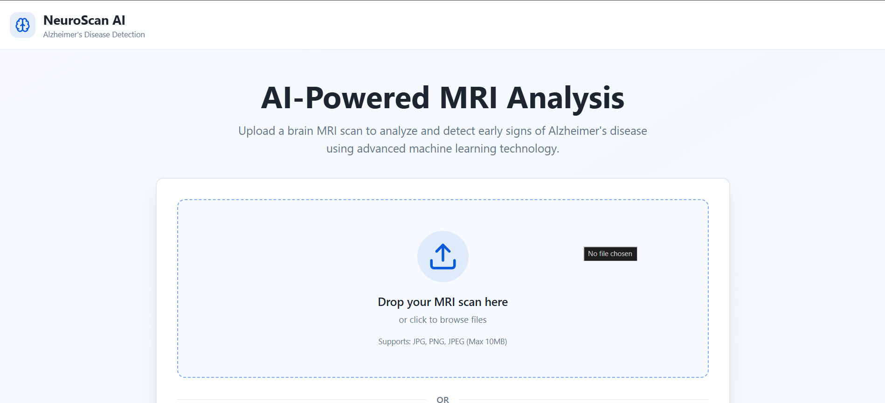
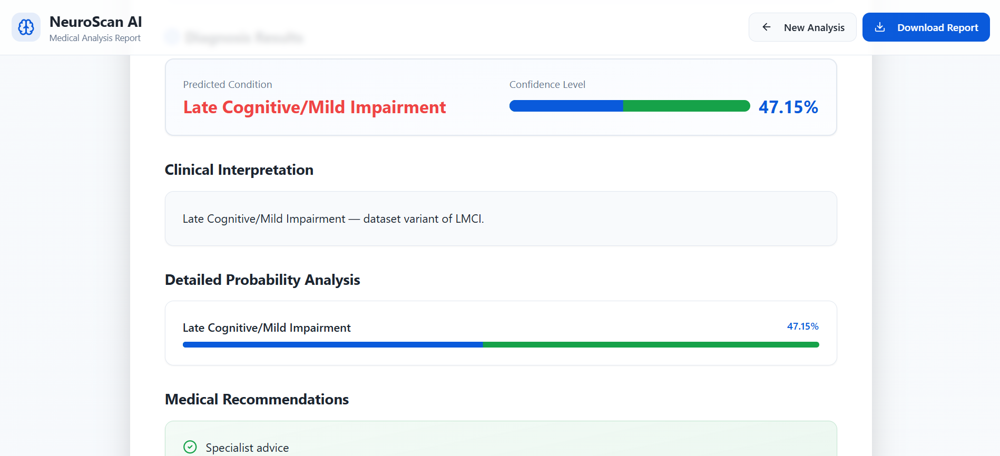

# NeuroScan AI 🧠🩺

**AI-Powered Brain MRI Analysis for Early Alzheimer’s Detection**

[](LICENSE)  
[](https://reactjs.org/)  
[](https://www.typescriptlang.org/)  
[](https://gradio.app/)  

---

## Table of Contents

- [Overview](#overview)  
- [Features](#features)  
- [Demo](#demo)  
- [Project Architecture](#project-architecture)  
- [Installation & Setup](#installation--setup)  
- [Usage](#usage)  
- [Technical Details](#technical-details)  
- [Screenshots](#screenshots)  
- [Contribution](#contribution)  
- [License](#license)  

---

## Overview

**NeuroScan AI** is a modern web application that leverages **machine learning** to analyze **brain MRI scans** and provide an early diagnosis of **Alzheimer’s disease**. The application integrates:

- **Gradio ML Model** for AI prediction  
- **React + TypeScript** frontend  
- **PDF report generation** with detailed medical recommendations  
- **Safe and user-friendly interface** for patients and medical professionals  

It allows uploading MRI scans either via **file upload** or **image URL**, performs analysis, and generates a professional **diagnostic report**.

---

## Features

- Upload or drag-and-drop **MRI scans** (JPG, PNG, JPEG)  
- Provide **image URLs** as input  
- AI-powered **disease classification** into six classes:
  - AD (Alzheimer’s Disease)
  - CN (Cognitively Normal)
  - ECMI (Early Cognitive/Mild Impairment)
  - EMCI (Early Mild Cognitive Impairment)
  - LCMI (Late Cognitive/Mild Impairment)
  - LMCI (Late Mild Cognitive Impairment)
- Display **confidence scores** and **probability distribution**  
- **Clinical interpretation** for each predicted class  
- **Medical recommendations** for patient care  
- **PDF download** of the full diagnostic report  
- Responsive and **mobile-friendly design**  
- Safe session handling with **React state and sessionStorage**

---

## Demo

 

### Upload Page

- Drag and drop an MRI scan OR paste image URL  
- Preview the image before analysis  
- Analyze MRI scans with **one click**  

### Report Page

- Shows predicted class, confidence, and probability graph  
- Clinical interpretation and recommendations  
- Download **professional PDF report**  

---

## Project Architecture

```plaintext
NeuroScan AI
│
├─ src/
│   ├─ pages/
│   │   ├─ UploadPage.tsx    # Upload & Prediction UI
│   │   └─ ReportPage.tsx    # Report display & PDF download
│   ├─ components/           # UI components (Cards, Buttons, Inputs)
│   └─ utils/                # Helper functions
│
├─ public/                   # Static assets (logos, icons)
├─ package.json               # Project dependencies
├─ tsconfig.json              # TypeScript configuration
└─ README.md                  # Project documentation

```

## Steps

### 1. Clone the repository:

```bash
git clone https://github.com/ADiTY0102/MRI_Alzheimer-Disease-Prediction.git
cd MRI_Alzheimer-Disease-Prediction
```
### 2. Install dependencies:

```bash
npm install
```

### 3. Start the development server:

```bash
npm run dev
```
## Usage

1. Go to the **Upload MRI Scan** page
2. Upload a file or paste an **image URL**
3. Click **Analyze MRI Scan**
4. Wait for the AI prediction
5. View the **Report Page**:
   - Predicted condition with confidence
   - Clinical interpretation
   - Detailed probability analysis
   - Medical recommendations
6. Optionally, **download the report as PDF**

---

## Technical Details

- **Frontend:** React 18, TypeScript, Tailwind CSS
- **Machine Learning Backend:** Gradio Space (`alzheimer-6class`)
- **PDF Generation:** html2canvas + jsPDF
- **State Management:** React hooks + sessionStorage
- **Routing:** React Router DOM

---

## Prediction Handling

- Handles **Blob / URL images**
- Confidence parsed from API safely to avoid `NaN` issues
- Stores predictions in **sessionStorage** for persistent report viewing

---

## Probability Normalization

- Probabilities displayed as **progress bars**
- Highest probability class highlighted for **quick diagnostics**

---

## Screenshots

### Upload Page


### Report Page!


---

## License

This project is licensed under the **MIT License**.  
See [LICENSE](LICENSE) for details.

---

## Contact

- GitHub: [ADiTY0102](https://github.com/ADiTY0102)
- Email: adityabinjagermath12@gmail.com
